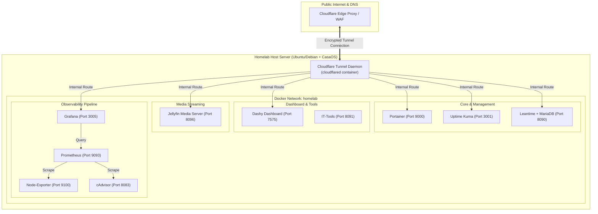
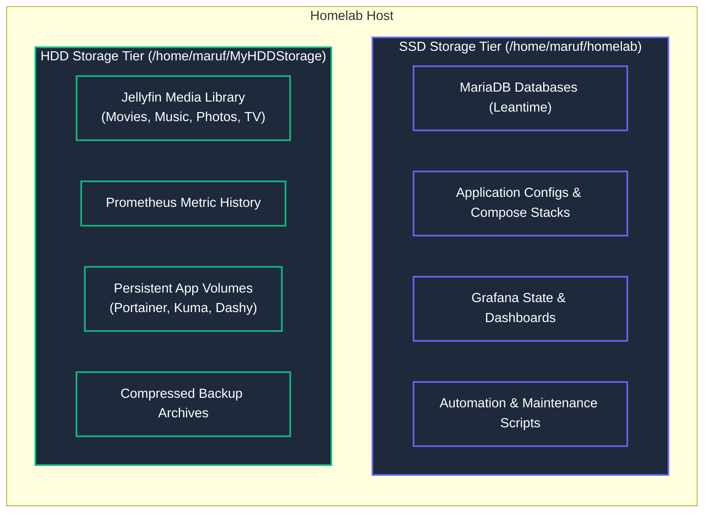

# 🏗️ Homelab Comprehensive Architecture & Expansion Guide

> [!NOTE]
> **Audit Status**: Your live setup is operating cleanly. All services remain online, routing securely via **Cloudflare Tunnels (`cloudflared`)** on the `homelab` Docker network.

---

## 1. System Architecture Diagrams

### A. Overall Homelab Topology (Ingress, Proxy & Services)



---

### B. Storage Tiering Model (SSD vs HDD)



---

## 2. Audit & Verification Checklist: Did You Miss Anything?

Here is a quick check of your setup:

| Checkpoint | Status | Details |
| :--- | :---: | :--- |
| **Live Services Running** | 🟢 **Pass** | All 12 live containers are active on `homelab` network without downtime. |
| **Storage Separation** | 🟢 **Pass** | Fast configs on SSD (`/home/maruf/homelab`), heavy media on HDD (`/home/maruf/MyHDDStorage/Jellyfin`). |
| **Secret Security** | 🟢 **Pass** | `.env` and runtime state are protected by `.gitignore` so no secrets leak to GitHub. |
| **Config Templates** | 🟢 **Pass** | `configs/` populated with Prometheus, Grafana, and Nginx templates. |
| **Backup Automation** | 🟢 **Pass** | `scripts/backup.sh` exports MariaDB dumps, archives configs, and cleans old backups. |

> [!TIP]
> **Recommended Action Items**:
> 1. Edit `/home/maruf/homelab/.env` to update default database passwords.
> 2. Add `scripts/backup.sh` to your user crontab (`crontab -e`) to run nightly at 3 AM.

---

## 3. Future Homelab Expansion Guide: Recommended Services to Add

Below is a curated list of powerful self-hosted applications that seamlessly integrate into your existing `homelab` network and storage model.

---

### Category A: Media Automation & Downloading (The "Arr" Stack)

| Service | Port | Storage Tier | Description |
| :--- | :---: | :---: | :--- |
| **Radarr** | `7878` | HDD | Automated movie downloader and library manager |
| **Sonarr** | `8989` | HDD | Automated TV series downloader and episode tracker |
| **Prowlarr** | `9696` | SSD | Indexer manager for Radarr and Sonarr |
| **qbittorrent** | `8085` | HDD | Torrent client for media downloads |

#### Docker Compose Example Snippet (`apps/media/docker-compose-arr.yml`):
```yaml
services:
  radarr:
    image: lscr.io/linuxserver/radarr:latest
    container_name: radarr
    restart: unless-stopped
    ports:
      - "7878:7878"
    environment:
      - PUID=1000
      - PGID=1000
      - TZ=Asia/Dhaka
    volumes:
      - ${SSD_DATA_DIR}/radarr/config:/config
      - ${HDD_DATA_DIR}/Jellyfin/Movies:/movies
      - ${HDD_DATA_DIR}/downloads:/downloads
    networks:
      - homelab

  sonarr:
    image: lscr.io/linuxserver/sonarr:latest
    container_name: sonarr
    restart: unless-stopped
    ports:
      - "8989:8989"
    environment:
      - PUID=1000
      - PGID=1000
      - TZ=Asia/Dhaka
    volumes:
      - ${SSD_DATA_DIR}/sonarr/config:/config
      - ${HDD_DATA_DIR}/Jellyfin/TV:/tv
      - ${HDD_DATA_DIR}/downloads:/downloads
    networks:
      - homelab
```

---

### Category B: Personal Photo Cloud & Storage

| Service | Port | Storage Tier | Description |
| :--- | :---: | :---: | :--- |
| **Immich** | `2283` | SSD + HDD | Self-hosted Google Photos alternative with AI face recognition |

- **SSD**: Machine learning model cache, PostgreSQL database, and thumbnail index.
- **HDD**: Raw photo & 4K video storage library.

---

### Category C: Password & Identity Management

| Service | Port | Storage Tier | Description |
| :--- | :---: | :---: | :--- |
| **Vaultwarden** | `8082` | SSD | Lightweight Bitwarden-compatible password manager in Rust |
| **Authelia / Authentik** | `9091` | SSD | Single Sign-On (SSO) & 2FA authentication layer for Nginx Proxy Manager |

#### Vaultwarden Docker Compose Snippet:
```yaml
services:
  vaultwarden:
    image: vaultwarden/server:latest
    container_name: vaultwarden
    restart: unless-stopped
    ports:
      - "8082:80"
    environment:
      - WEBSOCKET_ENABLED=true
    volumes:
      - ${SSD_DATA_DIR}/vaultwarden:/data
    networks:
      - homelab
```

---

### Category E: Git Code Hosting & Documentation

| Service | Port | Storage Tier | Description |
| :--- | :---: | :---: | :--- |
| **Forgejo / Gitea** | `3003` | SSD | Lightweight self-hosted GitHub alternative |
| **Outline / Wiki.js** | `3004` | SSD | Team wiki and personal knowledge base |

---

## 4. Summary & Recommended Next Steps

1. **Review Architecture Guide**: Inspect the Mermaid diagrams above to visualize your network and storage layout.
2. **Setup Nightly Backup Cron**:
   ```bash
   crontab -e
   # Add: 0 3 * * * /home/maruf/homelab/scripts/backup.sh >> /home/maruf/homelab/backups/backup.log 2>&1
   ```
3. **Commit & Push to GitHub**:
   ```bash
   cd /home/maruf/homelab
   git add .
   git commit -m "docs: add comprehensive homelab architecture guide and expansion roadmap"
   git push origin main
   ```
