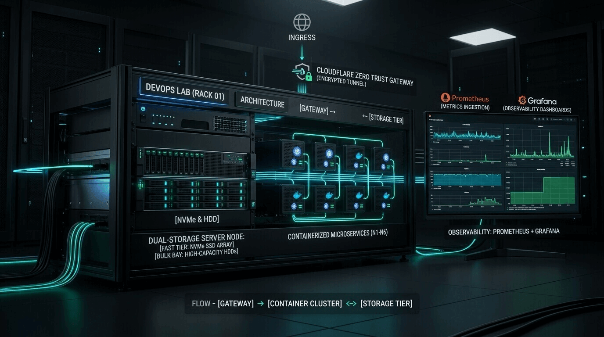

<p align="center">
  
</p>

# Personal Homelab Architecture & Infrastructure

[](https://docs.docker.com/compose/)
[](https://cloudflare.com)
[](LICENSE)

Production-grade, modular, self-hosted homelab infrastructure setup optimized for dual-storage (SSD/HDD) performance, automated monitoring, secure ingress via Cloudflare Tunnels, and containerized orchestration.

## 📌 Infrastructure Highlights

- **⚡ Dual Storage Tiering**:
  - **SSD (`/home/maruf/homelab`)**: Fast storage hosting compose files, database engine files, container configs, and low-latency application state.
  - **HDD (`/home/maruf/MyHDDStorage`)**: High-capacity storage hosting bulk media libraries (Jellyfin: Movies, Music, Photos, TV), raw monitoring retention data, and system backups.
- **🛡️ Security & Zero Trust Preparedness**: Strict `.gitignore` rules preventing accidental commit of environment variables, private keys, database dumps, and SSL certificates.
- **🌐 Network & Cloudflare Tunnel Integration**: All services run on a unified isolated bridge network (`homelab`) routed securely via Cloudflare Tunnels (`cloudflared`) without open inbound ports.
- **📊 Comprehensive Monitoring**: Full metrics pipeline with Prometheus, Grafana, Node-Exporter, and cAdvisor.
- **🏠 CasaOS Coexistence**: Designed to run seamlessly alongside CasaOS host services without port or path collisions.

## 🧰 Applications & Services Catalog

All active services deployed within this repository:

| Service | Category | Port | Storage Tier | Volume Location | Description |
| :--- | :--- | :---: | :---: | :--- | :--- |
| **Cloudflare Tunnel** | Core / Ingress | Outbound | Container | Host daemon | Zero Trust encrypted tunnel to Cloudflare |
| **Portainer** | Core / Mgmt | `9000`, `9443` | SSD / HDD | `${HDD_DATA_DIR}/docker/volumes/portainer` | Container lifecycle & Docker stack management |
| **Uptime Kuma** | Core / Status | `3001` | SSD / HDD | `${HDD_DATA_DIR}/docker/volumes/uptime-kuma` | Real-time monitoring & status pages |
| **Dashy** | Dashboard | `7575` | SSD | `${SSD_DATA_DIR}/dashy/conf.yml` | Feature-rich, highly customizable homelab dashboard |
| **IT-Tools** | Utilities | `8091` | Stateless | N/A | Handy developer & sysadmin utilities web app |
| **Maybe** | Finance | `8092` | SSD | `${SSD_DATA_DIR}/maybe/storage` | Personal finance, net worth & investment tracker |
| **Maybe Postgres** | Database | Internal (`5432`) | SSD | `${SSD_DATA_DIR}/maybe/postgres` | PostgreSQL database backend for Maybe |
| **Leantime** | Management | `8090` | SSD | `${SSD_DATA_DIR}/leantime/config` | Lean project management platform |
| **Leantime MariaDB** | Database | Internal (`3306`) | SSD | `${SSD_DATA_DIR}/leantime/mysql` | Database backend for Leantime |
| **Jellyfin** | Media | `8096` | SSD + HDD | Config: `${SSD_DATA_DIR}/jellyfin`<br>Media: `/home/maruf/MyHDDStorage/Jellyfin` | Self-hosted media streaming server |
| **Prometheus** | Monitoring | `9093` | SSD + HDD | Config: `./apps/monitoring/prometheus`<br>Data: `${HDD_DATA_DIR}/monitoring/prometheus` | Time-series metrics collection database |
| **Grafana** | Monitoring | `3005` | SSD | `${SSD_DATA_DIR}/grafana` | Metrics visualization & dashboards |
| **Node Exporter** | Monitoring | `9100` | Host | `/:/host:ro` | Host system hardware & OS metric exporter |
| **cAdvisor** | Monitoring | `8083` | Host | `/var/lib/docker:ro` | Container resource usage & performance metrics |

## 📂 Repository Structure

```
/home/maruf/homelab/
├── .env.example                  # Environment configuration template
├── .gitignore                     # Git safety & secret exclusion rules
├── README.md                      # Primary documentation & service table
├── ARCHITECTURE.md                # Network, storage, & security architecture
├── DEPLOYMENT.md                  # Deployment, upgrade, & backup runbook
├── SECURITY.md                    # Security best practices & hardening guide
├── docker-compose.yml             # Master Docker Compose file (utilizes 'include')
├── apps/                          # Modular application stacks
│   ├── core/                      # Core infrastructure (Portainer, Uptime Kuma)
│   │   └── docker-compose.yml
│   ├── dashboard/                 # User dashboard & tools (Dashy, IT-Tools)
│   │   └── docker-compose.yml
│   ├── management/                # Project management (Leantime + MariaDB)
│   │   └── docker-compose.yml
│   ├── media/                     # Media streaming (Jellyfin + HDD mount)
│   │   └── docker-compose.yml
│   └── monitoring/                # Observability (Prometheus, Grafana, Node-Exporter, cAdvisor)
│       ├── docker-compose.yml
│       └── prometheus/
│           └── prometheus.yml
├── scripts/                       # Infrastructure automation scripts
│   ├── init-homelab.sh            # Setup network, directories, and .env
│   └── remove-filebrowser.sh      # Legacy service removal script
└── volumes/                       # Local SSD persistent volume mount targets
    └── .gitkeep
```

## ⚡ Quick Start

### 1. Prerequisites
- Docker Engine `24.0+` and Docker Compose `v2.20+`
- Existing Docker network `homelab` (or created via initialization script)

### 2. Initialization
Run the initialization script to prepare environment configuration and Docker networks:
```bash
./scripts/init-homelab.sh
```

### 3. Environment Configuration
Copy `.env.example` to `.env` (if not auto-created) and adjust secrets/paths:
```bash
cp .env.example .env
nano .env
```

### 4. Validate Configuration
Ensure all modular compose files are valid:
```bash
docker compose config
```

### 5. Deploy Stacks

Deploy everything at once via the master compose file:
```bash
docker compose up -d
```

Or deploy individual stacks independently:
```bash
docker compose -f apps/core/docker-compose.yml up -d
docker compose -f apps/dashboard/docker-compose.yml up -d
docker compose -f apps/management/docker-compose.yml up -d
docker compose -f apps/media/docker-compose.yml up -d
docker compose -f apps/monitoring/docker-compose.yml up -d
```

## 🌐 Cloudflare Tunnel Integration

All web applications are connected via the `homelab` Docker network and exposed through Cloudflare Tunnels:

1. **Outbound Encrypted Tunnel**: `cloudflared` initiates an outbound connection to Cloudflare edge networks without requiring inbound port forwarding (80/443).
2. **Container Hostname Routing**: Cloudflare Public Hostnames route incoming requests directly to internal Docker service names over the `homelab` network (e.g. `http://jellyfin:8096`, `http://dashy:8080`, `http://grafana:3000`).
3. **Zero Trust & Edge Security**: TLS termination, DDoS mitigation, and Access rules are enforced at the Cloudflare Edge.

## 🏠 CasaOS Coexistence

If running alongside CasaOS:
- CasaOS web UI runs on port `80` or custom port.
- This homelab repository uses explicit host port mappings (`7575` for Dashy, `8090` for Leantime, etc.) to prevent port conflicts with CasaOS host applications.
- Docker containers deployed via CasaOS UI can easily join the `homelab` external network.

## 🤝 Maintenance & Support

- **Check Service Status**: `docker compose ps`
- **View Container Logs**: `docker compose logs -f [service_name]`
- **Stop All Services**: `docker compose down`

For detailed operational procedures, backup strategies, and recovery steps, see [DEPLOYMENT.md](DEPLOYMENT.md).
For a comprehensive catalog of popular self-hosted applications and tools, see [RECOMMENDED_TOOLS.md](RECOMMENDED_TOOLS.md).
