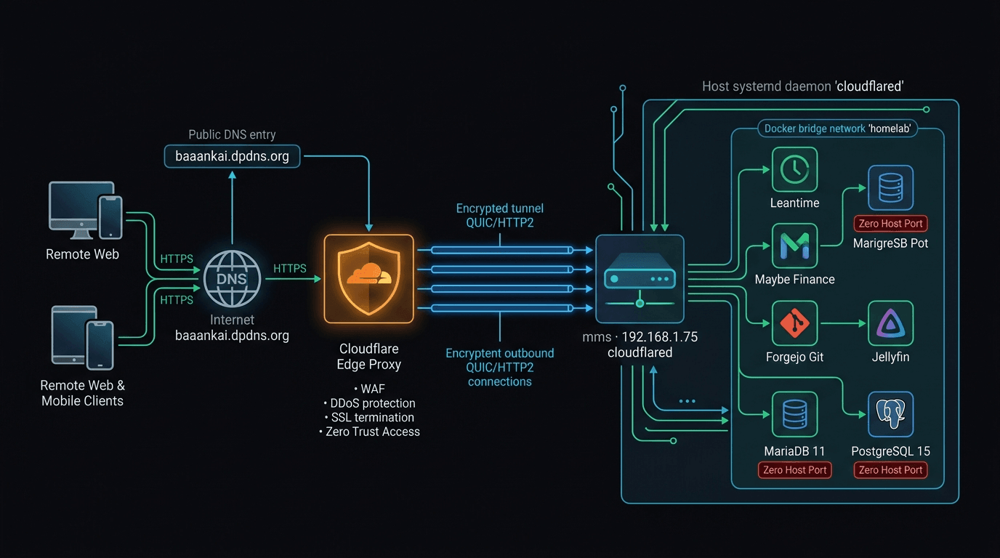
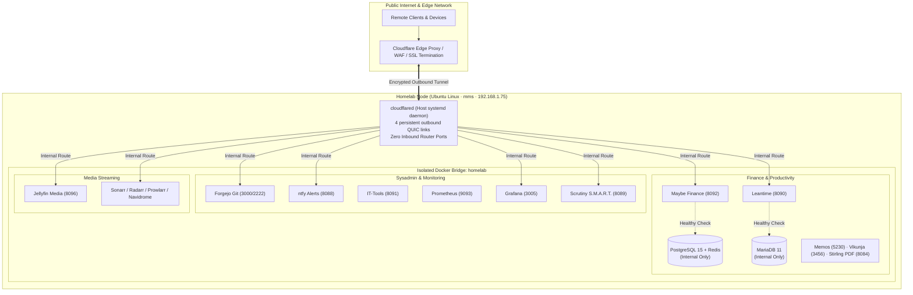
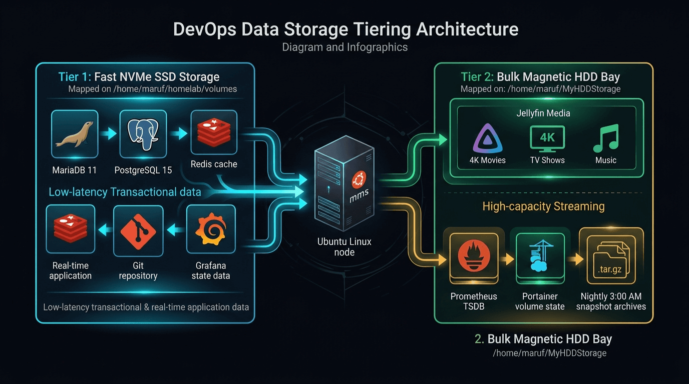
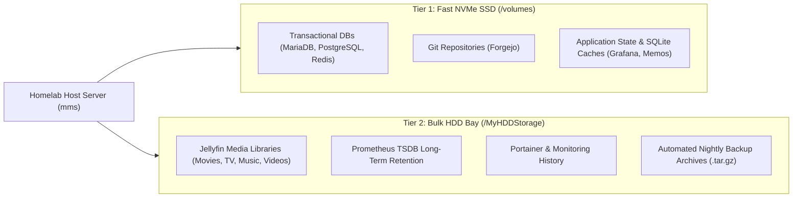
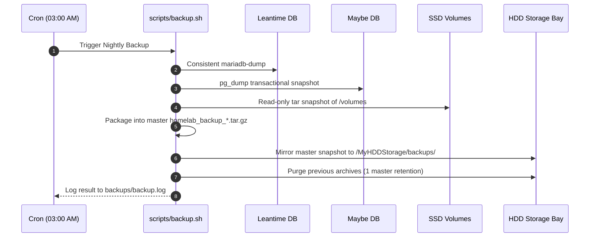
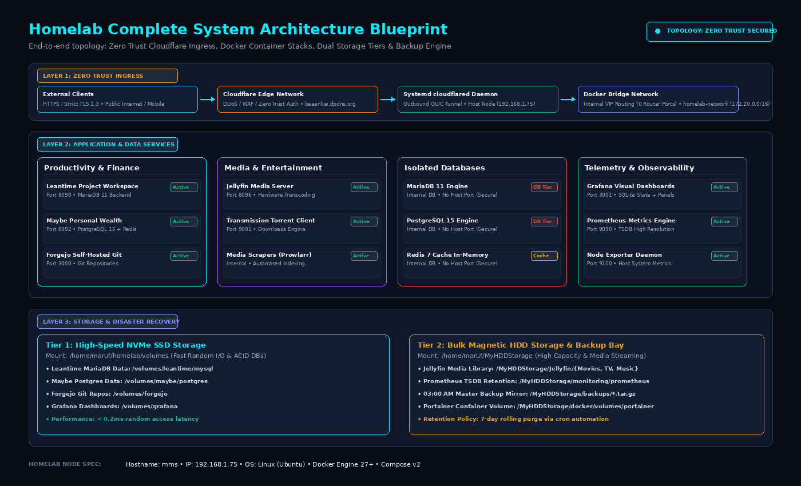

<p align="center">
  
</p>

# Personal Homelab Architecture & DevOps Infrastructure

[](site/index.html)
[](https://docs.docker.com/compose/)
[](https://cloudflare.com)
[](scripts/backup.sh)
[](LICENSE)

Production-grade, modular self-hosted homelab infrastructure optimized for **dual-tier storage performance (NVMe SSD + Bulk HDD)**, category-wise feature toggles, automated database healthchecks, nightly snapshot disaster recovery, and secure edge ingress via **Cloudflare Zero Trust Tunnels**.

---

## 🌐 Interactive Architecture Portal

Explore the full homelab visually with our high-performance static portal:

- 🏛️ **[Architecture & System Map](site/index.html)** — Dual-storage tiering, ingress topology flowcharts, and live system specs.
- 📦 **[Application Catalog](site/services.html)** — 36+ containerized stacks across 12 functional domains with status filters.
- 🛠️ **[Resources & Developer Toolkits](site/resources.html)** — Curated workstation software, modern CLI replacements, and role blueprints.
- 📖 **[DevOps Operations Playbook](site/runbook.html)** — Copy-ready bash automation, diagnostic snippets, and troubleshooting routines.
- 🔌 **[Port Matrix Inspector](site/ports.html)** — Collision-free host port bindings and bridge isolation verification.
- 💾 **[Storage & Backups Visualizer](site/storage.html)** — Detailed mount allocations and step-by-step backup pipeline breakdown.

---

## 🏗️ Homelab Architecture A-Z

### 1. Ingress & Zero Trust Network Topology

<p align="center">
  
</p>



---

### 2. Smart Dual-Tier Storage Architecture

<p align="center">
  
</p>



---

### 3. Automated Disaster Recovery Pipeline (03:00 AM Cron)

<p align="center">
  
</p>



---

### 4. Complete System Architecture Blueprint

<p align="center">
  
</p>

---

## 🧰 Active Services & Storage Allocation

| Service | Category | Host Port | Storage Tier | Description |
| :--- | :--- | :---: | :---: | :--- |
| **Cloudflare Tunnel** | Network & Ingress | Outbound only | Host Daemon | Systemd service (`cloudflared`) managed via Cloudflare Zero Trust |
| **Portainer** | Sysadmin & DevOps | `9000`, `9443` | HDD | Container management & orchestration UI |
| **IT-Tools** | Sysadmin & DevOps | `8091` | Stateless | Developer toolbox with 50+ utilities |
| **Forgejo** | Sysadmin & DevOps | `3000` (HTTP), `2222` (SSH) | SSD | Lightweight self-hosted Git server |
| **ntfy** | Sysadmin & DevOps | `8088` | SSD | Simple HTTP-based pub-sub push notification service |
| **Scrutiny** | Monitoring | `8089` | SSD | Hard drive S.M.A.R.T. metrics collector & web UI |
| **Maybe Finance** | Finance & Wealth | `8092` | SSD | Personal finance and wealth tracking platform |
| **Maybe Postgres** | Finance & Wealth | `5432` (Internal) | SSD | Dedicated PostgreSQL 15 database instance |
| **Leantime** | Productivity | `8090` | SSD | Agile project management and strategy workspace |
| **Leantime MariaDB** | Productivity | `3306` (Internal) | SSD | MariaDB 11 transactional storage engine |
| **ChangeDetection** | Productivity | `5001` | SSD | Real-time web page monitoring and diff alerting |
| **Stirling PDF** | Productivity | `8084` | Stateless | Robust local PDF manipulation toolbox |
| **Memos** | Productivity | `5230` | SSD | Privacy-first lightweight note-taking service |
| **Vikunja** | Productivity | `3456` | SSD | Open-source to-do and task management app |
| **Jellyfin** | Media & Streaming | `8096` | HDD | High-performance open-source media streaming server |
| **Arr Suite** | Media & Streaming | `8989`, `7878`, `9696` | SSD + HDD | Sonarr, Radarr, Prowlarr media management stack |
| **qBittorrent** | Media & Streaming | `8087` | HDD | Fast BitTorrent client with Web UI |
| **Navidrome** | Media & Streaming | `4533` | SSD + HDD | Subsonic-compatible personal music streaming server |
| **Prometheus** | Monitoring | `9093` | SSD + HDD | High-throughput time-series metrics database |
| **Grafana** | Monitoring | `3005` | SSD | Telemetry visualization dashboards |
| **Node Exporter** | Monitoring | `9100` (Internal) | Host Daemon | Host OS and hardware metrics exporter |
| **cAdvisor** | Monitoring | `8083` | Host Runtime | Container resource utilization collector |

---

## 📂 Repository Layout

```
/home/maruf/homelab/
├── .github/workflows/deploy-pages.yml # Automatic GitHub Pages deployment workflow
├── .env.example                  # Environment template with feature toggle switches
├── .env                          # Active environment (gitignored — never committed)
├── .gitignore                    # Comprehensive secrets and volume protection
├── README.md                     # This file — master overview, diagrams, and quickstart
├── ARCHITECTURE.md               # In-depth architectural & storage design specification
├── DEPLOYMENT.md                 # Complete ops runbook: deploy, update, troubleshooting
├── BACKUP_AND_RESTORE_GUIDE.md   # Disaster recovery, cron automation, and restore steps
├── SECURITY.md                   # Threat model, secret management, and hardening guide
├── RECOMMENDED_TOOLS.md          # 12-category self-hosted server application catalog
├── RECOMMENDED_OPEN_SOURCE_APPS.md # 14-category workstation and CLI developer toolkit
├── docker-compose.yml            # Master compose file using Docker Compose v2.20+ include
├── index.html                    # Root forwarder to interactive portal
├── site/                         # Interactive static architecture & catalog portal
│   ├── index.html                # Architecture & System Map
│   ├── services.html             # Application Catalog & Stacks
│   ├── resources.html            # Workstation Toolkits & Role Blueprints
│   ├── runbook.html              # DevOps Operations Playbook
│   ├── ports.html                # Port Matrix & Network Security
│   ├── storage.html              # Storage Tiering & Backup Pipeline
│   ├── css/                      # Design system tokens, layouts & components
│   ├── js/                       # Live data catalog & search controller
│   └── assets/                   # Architecture visuals & branded covers
├── apps/                         # 12 Category-Wise Modular Stacks
│   ├── media/                    # Category 1: Media (Jellyfin, Sonarr, Radarr…)
│   ├── finance/                  # Category 2: Finance (Maybe + Postgres + Redis)
│   ├── dashboards/               # Category 3: Dashboards (Dashy, Homepage, Glance)
│   ├── network/                  # Category 4: Network & Ingress (cloudflared)
│   ├── monitoring/               # Category 5: Observability (Prometheus, Grafana…)
│   ├── storage/                  # Category 6: Storage & Cloud
│   ├── security/                 # Category 7: Security & Auth
│   ├── productivity/             # Category 8: Productivity (Leantime, ChangeDetection…)
│   ├── automation/               # Category 9: Home Automation & IoT
│   ├── sysadmin/                 # Category 10: Sysadmin (Portainer, IT-Tools, Forgejo)
│   ├── ai/                       # Category 11: Local AI & LLM Hub
│   └── workflows/                # Category 12: Workflows & Integrations
├── scripts/
│   ├── init-homelab.sh           # First-run: creates Docker network & volume directories
│   ├── deploy.sh                 # Category deployer with port collision validation
│   ├── backup.sh                 # Automated database dumps + snapshot mirroring
│   └── restore.sh                # Interactive step-by-step disaster recovery script
└── volumes/                      # SSD persistent mount targets (gitignored)
```

---

## ⚡ Quick Start

### 1. Initialize Environment
```bash
git clone https://github.com/maruf-pfc/homelab.git /home/maruf/homelab
cd /home/maruf/homelab
cp .env.example .env
nano .env           # Configure secure passwords and storage paths
./scripts/init-homelab.sh
```

### 2. Enable Required Categories & Services
In `.env`, toggle the services you wish to activate:
```bash
ENABLE_LEANTIME=true
ENABLE_MAYBE=true
ENABLE_CHANGEDETECTION=true
ENABLE_GRAFANA=true
ENABLE_JELLYFIN=true
```

### 3. Deploy Stacks
```bash
./scripts/deploy.sh
```

### 4. Verify Active Workloads
```bash
docker ps --format "table {{.Names}}\t{{.Status}}\t{{.Ports}}"
```

---

## 💾 Automated Backup & Recovery

Nightly automated snapshot runs at **03:00 AM** via cron:
```cron
0 3 * * * /home/maruf/homelab/scripts/backup.sh >> /home/maruf/homelab/backups/backup.log 2>&1
```

- **Transactional DB Snapshots**: Live dumps of MariaDB and PostgreSQL backends.
- **SSD Volume Tar**: Read-only atomic compression of `/home/maruf/homelab/volumes`.
- **Secondary HDD Mirror**: Mirrored to `/home/maruf/MyHDDStorage/backups/`.
- **Single Master Retention**: Keeps only the most recent clean archive to conserve storage.

To run a manual on-demand backup:
```bash
./scripts/backup.sh
```

For guided restoration, see [BACKUP_AND_RESTORE_GUIDE.md](BACKUP_AND_RESTORE_GUIDE.md).

---

## 🔒 Security & Privacy Model

- **Zero Host Inbound Ports**: All external routing is mediated through Cloudflare Zero Trust Tunnels.
- **Network Isolation**: Databases reside strictly on internal Docker networks without exposed host ports.
- **Secret Isolation**: Secrets reside solely in `.env` (gitignored).
- **Readiness Probes**: Database dependencies utilize `condition: service_healthy` to prevent premature app starts.
- For complete details, see [SECURITY.md](SECURITY.md).

---

## 📄 Documentation Reference

- 🏛️ [**`ARCHITECTURE.md`**](ARCHITECTURE.md) — Comprehensive technical design & storage blueprint
- 🚀 [**`DEPLOYMENT.md`**](DEPLOYMENT.md) — Production operations & troubleshooting runbook
- 💾 [**`BACKUP_AND_RESTORE_GUIDE.md`**](BACKUP_AND_RESTORE_GUIDE.md) — Disaster recovery & snapshot restoration
- 🔒 [**`SECURITY.md`**](SECURITY.md) — Security model & system hardening
- 🧰 [**`RECOMMENDED_TOOLS.md`**](RECOMMENDED_TOOLS.md) — 12-category self-hosted server application catalog
- 💻 [**`RECOMMENDED_OPEN_SOURCE_APPS.md`**](RECOMMENDED_OPEN_SOURCE_APPS.md) — 14-category workstation & CLI developer toolkit

---

## 📜 License

[MIT License](LICENSE) — © Maruf
